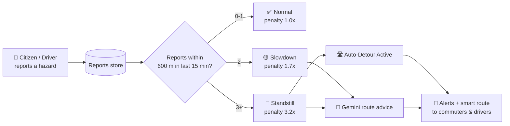
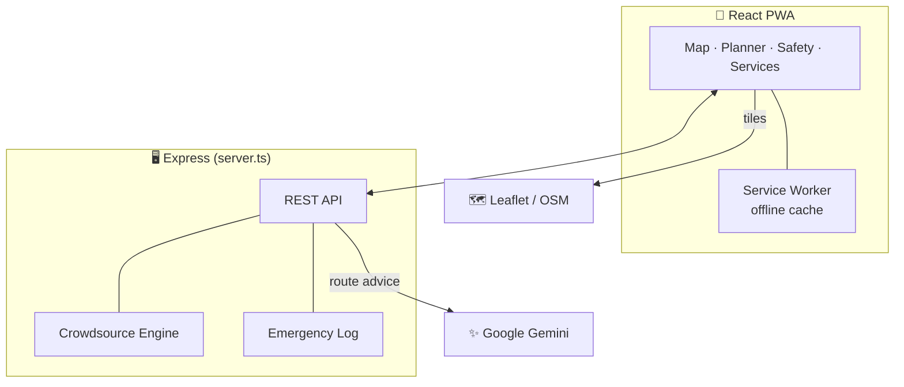

<div align="center">


<a href="https://github.com/Anucodex21/e-rahi-bareilly">
  
</a>

<br/>


<p>
  <b>Hyperlocal traffic, e-rickshaw routing, women's safety and city services — in one PWA.</b>
</p>

</div>

E-Rahi started as a crowdsourced congestion app for Bareilly's choked markets, railway crossings and e-rickshaw gridlocks. It is now growing into a multi-service city app: smart detours, an SOS safety guard, and a directory of hospitals, hotels, colleges and local stores.

> **Status:** working prototype / demo build. The backend keeps data in memory (it resets on server restart) and much of the directory data is seeded sample data. See [Roadmap](#roadmap).

---

## 📑 Table of Contents

[Features](#-features) · [Auto-Detour Engine](#-how-the-auto-detour-engine-works) · [Tech Stack](#-tech-stack) · [Getting Started](#-getting-started) · [API](#-api-reference) · [Structure](#-project-structure) · [Roadmap](#%EF%B8%8F-roadmap) · [Contributing](#-contributing)

---

## ✨ Features

### 🚦 Traffic & Routing
- **Live map** (Leaflet) with crowdsourced hazard reports: gridlocks, bottlenecks, railway-crossing closures, festival rush.
- **Crowdsource modal** — report a hazard with GPS location, severity and an avoidance tip; upvote/downvote reports.
- **Smart route planner** for commuters and e-rickshaw drivers, with AI-generated detour advice.
- **Auto-detour engine** — if **3+ reports** land within **15 minutes** inside a **600 m** radius of a monitored segment, its routing penalty jumps to **3.2×** and the segment is flagged *Standstill (Auto-Detour Active)*. Two reports raise it to *Slowdown* (1.7×).
- **Driver cockpit**, bottleneck analytics, and a **traffic-police advisory banner / festival bulletin**.
- **Hazard proximity alerts** with audio chime and haptic buzz.

### 💰 Fares & Mobility
- **Fare calculator** for local shared/e-rickshaw routes.
- **UPI fare splitter**, **EV battery radar**, **auto-stand directory**, and an **offline pocket** mode for low-connectivity use.

### 🛡️ Women's Safety Guard
- One-tap **SOS** with live GPS location, shareable via WhatsApp / SMS to saved guardians.
- **Pre-shutdown "last gasp" broadcast** — sends last known location when battery is critical.
- **Power-restored tracking** — logs when the device comes back online.
- Emergency contacts manager and configurable safety-guard settings.

### 🏙️ City Services Directory
- **Hospitals & clinics** — specialists, contact info, OPD details.
- **Hotels & lodges** — including hourly and student-friendly stays for visitors (exams, interviews, work trips).
- **Colleges & universities**, **local stores / pharmacies**, plus **store promotion** and **appointment booking** flows.
- **Premium Pass — ₹49/month:** free users see the first 2 results per listing, the rest are blurred; premium unlocks everything.

### 🌐 Platform
- **Trilingual UI:** English, हिन्दी, اردو.
- **Multi-state / multi-city selector** (20 states, 60+ hubs of seed data) — Bareilly is the deep, hyperlocal reference city.
- **Voice assistant** (Web Speech API), citizen complaint filing, auth modal (login / register / OTP flow, commuter & driver roles).
- **PWA** — installable, with a service worker caching the app shell and map tiles.

---

## 🧠 How the Auto-Detour Engine Works





---

## 🧱 Tech Stack

| Layer | Tech |
|---|---|
| Frontend | React 19, TypeScript, Vite 6, Tailwind CSS 4, Motion, Lucide icons |
| Maps | Leaflet (OpenStreetMap tile fallback) |
| Backend | Node.js, Express 4 (`server.ts`, run with `tsx`) |
| AI | Google Gemini via `@google/genai` (server-side; falls back to a local rule-based engine if no key is set) |
| PWA | Web App Manifest + Service Worker |


<p align="center">
  
</p>

---

## 🚀 Getting Started

**Prerequisites:** Node.js 18+ (npm, or Bun — a `bun.lock` is included)

```bash
# 1. Clone the repo
git clone https://github.com/Anucodex21/e-rahi-bareilly.git
cd e-rahi-bareilly

# 2. Install dependencies
npm install

# 3. Configure environment
cp .env.example .env.local        # Windows (PowerShell): copy .env.example .env.local
#   then edit .env.local and set GEMINI_API_KEY

# 4. Start the dev server (Express + Vite middleware)
npm run dev
```

Open **http://localhost:3000**.

### Environment variables

| Variable | Required | Description |
|---|---|---|
| `GEMINI_API_KEY` | Optional* | Enables Gemini-powered route advice. *Without it, the app uses the built-in fallback guidance.* |
| `APP_URL` | Optional | Public URL where the app is hosted. |
| `VITE_BASEMAP_API_KEY` | Optional | Basemap tile API key. |

### Scripts

| Command | What it does |
|---|---|
| `npm run dev` | Starts Express + Vite dev server on port 3000 |
| `npm run build` | Builds the frontend and bundles the server to `dist/server.cjs` |
| `npm start` | Runs the production build (`node dist/server.cjs`) |
| `npm run lint` | Type-checks with `tsc --noEmit` |

---

## 🔌 API Reference

<details>
<summary><b>📡 Click to expand all endpoints</b></summary>

| Method | Endpoint | Purpose |
|---|---|---|
| GET | `/api/health` | Health check |
| GET / POST | `/api/reports` | List / create crowdsourced traffic reports |
| POST | `/api/reports/:id/vote` | Upvote / downvote a report |
| GET | `/api/algorithm/segment-weights` | Current penalty weights for monitored road segments |
| POST | `/api/algorithm/simulate-cluster` | Demo: inject 3 reports to trigger auto-detour |
| POST | `/api/algorithm/reset` | Reset weights and clear simulated reports |
| POST | `/api/spatial/nearby-hazards` | Hazards within a radius of `{ lat, lng }` (Haversine) |
| GET / POST | `/api/complaints` | List / file citizen complaints |
| POST | `/api/emergency/sos` | Log an SOS trigger |
| POST | `/api/emergency/last-known-location` | Log pre-shutdown last known location |
| POST | `/api/emergency/device-restored` | Log device power-on |
| GET | `/api/emergency/events` | Recent emergency events and last known location |
| POST | `/api/ai-route-advice` | AI (or fallback) detour advice for an origin → destination |

</details>

---

## 📁 Project Structure

```
├── server.ts                 # Express API + crowdsource algorithm + Gemini integration
├── index.html
├── vite.config.ts
├── public/
│   ├── manifest.webmanifest  # PWA manifest
│   ├── sw.js                 # Service worker
│   └── icon.svg
└── src/
    ├── App.tsx               # App shell, tabs, routing between views
    ├── main.tsx              # Entry point + error boundary
    ├── types.ts
    ├── components/           # Map, RoutePlanner, WomenSafetyPage, CityServicesDirectory,
    │                         # FareCalculator, PremiumPassModal, AuthModal, ...
    ├── data/                 # Bareilly data, India cities, city services, women-safety data
    └── utils/                # i18n (en/hi/ur), audio alerts, safety guardian
```

---

## 🗺️ Roadmap

- [ ] Persistent database (PostgreSQL + PostGIS for spatial queries) replacing in-memory storage
- [ ] Real authentication and payments for the Premium Pass
- [ ] Server-side SMS / WhatsApp dispatch for SOS alerts
- [ ] Live-verified listings: hospital, hotel and college ratings
- [ ] Transport partnerships (e.g. Uber, RedBus) for bookings
- [ ] Deeper hyperlocal data beyond Bareilly

---

## 🤝 Contributing

Ideas and bug reports are welcome — open an [issue](https://github.com/Anucodex21/e-rahi-bareilly/issues) or send a pull request:

1. Fork the repo
2. Create a branch: `git checkout -b feature/your-feature`
3. Commit your changes and push
4. Open a Pull Request

---

## 👤 Author

**Arjun** — BCA student at MJPRU, Bareilly, building toward a full-stack AI engineering role.

[](https://github.com/Anucodex21)

⭐ If E-Rahi helps you, star the repo: [Anucodex21/e-rahi-bareilly](https://github.com/Anucodex21/e-rahi-bareilly)

<div align="center">

<a href="https://github.com/Anucodex21/e-rahi-bareilly">
  
</a>

<br/><br/>


</div>
